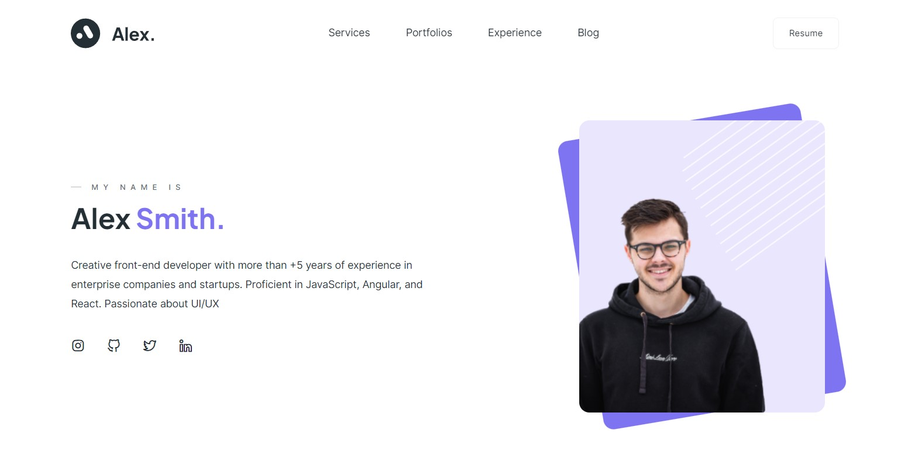

<h1 align="center">Personal web-page "Alex"</h1>
<h3 align="center">Как посмотреть</h3>

Для запуска скачать репозиторий и открыть index.html в браузере. Либо открыв данный проект по <a href="https://kovalinam.github.io/alex/">ссылке</a>

Макет Figma, по которому была сверстана страница, доступен по  <a href="https://disk.yandex.ru/d/YAMXf-TV28Z2iA">ссылке</a>

<h3 align="center">Скриншот главного экрана страницы</h3>

